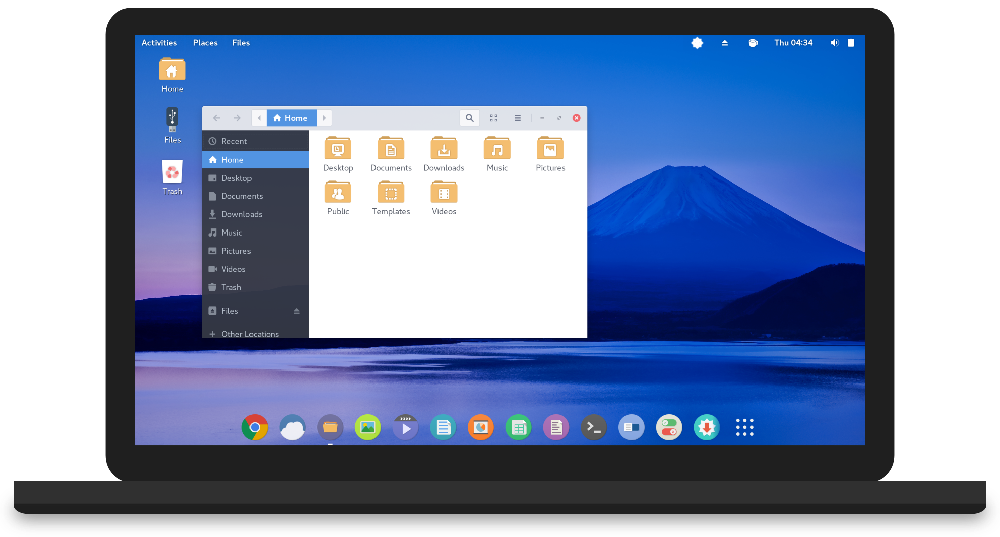

# **Notes for Arch (LSB 1.4)**

I am evaluating [Apricity](https://apricityos.com/) on ASUS ZenBook UX305.  Apricity distro is based on [Arch Linux](https://www.archlinux.org/).



## **Base Versions**

* Scripting Engines
    * Python2 2.7.12
    * Python 3.5.2 (`python`)
        * Pip 8.1.2 for python 3
    * Perl 5.24.0
    * Bash 4.4.5
    * Zsh 5.2
* Tools
    * awk - GNU Awk 4.1.4
    * bc 1.06.95
    * sed - GNU Sed 4.2.2
    * sh - bash?
    * vi - Vi Improved 8.0
    * wget - WGET 1.18
* Tool Sets
    * GNU coreutils 8.25 - cut, env, expr, sort, tr
    * GNU findutils 4.6.0 - find

## **Applications, Tools, and Environments**

### **Perl**

```bash
# install package manager wrapper
sudo pacman -S cpanminus
# install perl modules
cpanm YAML::XS
```


### **Ansible**

**Requirement:**: Python 2 Environment (installed with pacman)

```bash
sudo pacman -S ansible
```

## **Docker & Docker-Compose**

```bash
# Install
sudo pacman -S docker docker-compose
# Service
sudo systemctl start docker
sudo systemctl enable docker
# Post Install Setup
sudo usermod -aG docker ${USER}
```

See: https://docs.docker.com/engine/installation/linux/archlinux/

## **Vagrant & VirtualBox**

**Important Note**: Secure Boot ***MUST*** be turned off.

```bash
# Install
sudo pacman -S virtualbox-host-modules-arch
sudo pacman -S virtualbox
sudo pacman -S vagrant
sudo modprobe vboxdrv
# Post install
sudo usermod -aG vboxusers ${USER}
```

See: https://wiki.archlinux.org/index.php/VirtualBox

## **Spotify**

```bash
git clone https://aur.archlinux.org/spotify.git
cd spotify
makepkg -sri
```

Using Windows Spotify: https://wiki.archlinux.org/index.php/spotify
